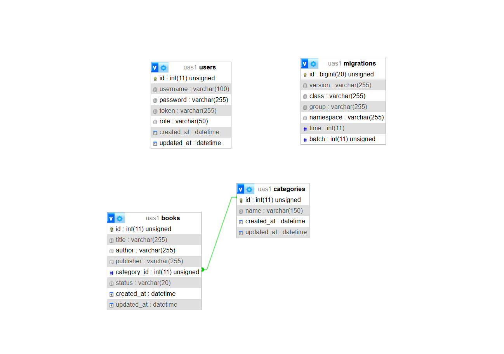
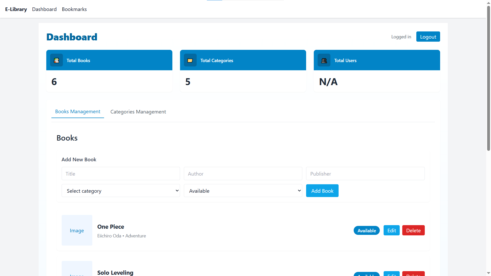

# 📚 E-Library - Sistem Informasi Peminjaman Buku
## 📌 Deskripsi Proyek

E-Library adalah aplikasi web berbasis sistem peminjaman buku sederhana yang dibangun untuk memenuhi tugas UAS mata kuliah Pemrograman Web 2.

Aplikasi ini memisahkan backend dan frontend (decoupled architecture), di mana backend menggunakan CodeIgniter 4 sebagai REST API dan frontend dibangun menggunakan VueJS 3 (CDN) dengan TailwindCSS untuk tampilan antarmuka.

Sistem ini memungkinkan pengguna untuk melihat daftar buku, melakukan peminjaman, serta pengelolaan data buku dan kategori oleh admin melalui dashboard.

## 🧱 Teknologi yang Digunakan
Backend: CodeIgniter 4 (REST API)
Frontend: VueJS 3 (CDN)
Styling: TailwindCSS
HTTP Client: Axios
Database: MySQL / MariaDB
Authentication: Bearer Token (JWT-like simple token system)

## 🗂️ Struktur Database

Aplikasi ini menggunakan 3 tabel utama:

users
categories
books

Relasi:

books.category_id terhubung ke categories.id
Sistem login menggunakan tabel users
(Opsional jika ada) borrowings untuk sistem peminjaman

## 📸 Screenshot ERD / Relasi Database:

.

## 🔐 Keamanan API

Semua endpoint yang bersifat manipulasi data (POST, PUT, DELETE) dilindungi menggunakan Bearer Token.

## 📸 Contoh Error 401 Unauthorized:

(Masukkan screenshot Postman gagal akses tanpa token)

# 🖥️ Tampilan Aplikasi

# 🔑 Halaman Login

.

# 📊 Dashboard Admin

.

➕ Form Tambah / Edit Data

(Masukkan screenshot modal form)

# 📚 Tabel Data Buku & Kategori (TailwindCSS UI)

(Masukkan screenshot tabel)

## ⚙️ Cara Instalasi & Menjalankan Project

### 1. Clone repository
git clone https://github.com/Celtdinho/E-Library.git

### 2. Backend (CodeIgniter 4)
cd backend-api
composer install
php spark serve

Jika pakai XAMPP:

http://localhost/UAS%20Web/backend-api/public
### 3. Frontend (Vue SPA)
cd frontend-spa

Lalu buka:

index.html

Atau pakai Live Server VSCode agar lebih stabil.

### 4. Database
Import file SQL ke phpMyAdmin
Atur koneksi di .env CI4

## 🎯 Fitur Utama

Login & Logout dengan token
CRUD Buku
CRUD Kategori
Role Admin (dashboard)
Role User (home + borrow buku)
Sistem peminjaman buku
Proteksi API dengan Auth Filter
Navigation Guard di frontend

## 🌐 Demo & Presentasi

🔗 GitHub Repo: https://github.com/Celtdinho/E-Library
🎥 Video Presentasi: (isi link YouTube / Drive di sini)
🌍 Demo Lokal: http://localhost/UAS%20Web/frontend-spa/
📌 Catatan

Project ini dibuat sebagai tugas UAS dan dikembangkan dengan konsep decoupled architecture agar backend dan frontend berjalan secara terpisah namun tetap saling terintegrasi melalui REST API.
